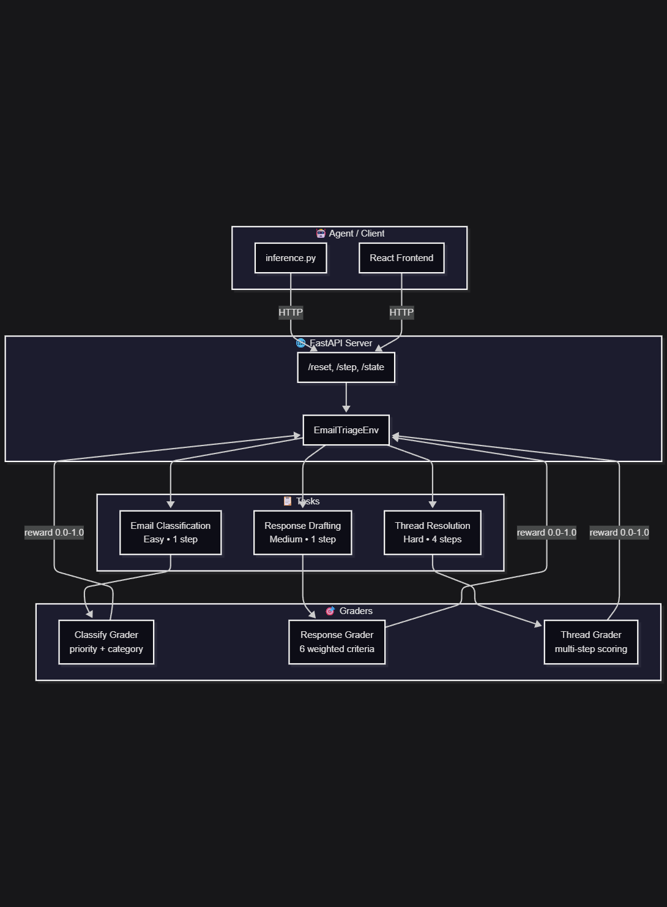

# Email Triage & Response — OpenEnv Environment

[](https://github.com/huggingface/openenv)
[](https://www.python.org/)
[](https://fastapi.tiangolo.com/)
[](LICENSE)

> **Meta x Hugging Face OpenEnv Hackathon Submission**

An OpenEnv environment that simulates real-world email triage — the kind of work customer support teams do every day. AI agents classify emails by priority and category, draft professional responses to complaints, and resolve multi-email threads where different senders contradict each other. Three tasks with increasing difficulty, deterministic grading, and meaningful partial-credit rewards.

| Link | Description |
|------|-------------|
| [Live API](https://emitboi-email-triage-env.hf.space/) | Health check, `/reset`, `/step`, `/state` |
| [HF Space](https://huggingface.co/spaces/EmitBoi/email-triage-env) | Deployed environment |
| [GitHub](https://github.com/tanmay-sahoo89/email-triage-openenv) | Source code |

```bash
# Quick test
curl https://emitboi-email-triage-env.hf.space/
curl -X POST https://emitboi-email-triage-env.hf.space/reset \
  -H "Content-Type: application/json" \
  -d '{"task_id": "email_classify"}'
```

---

## Environment Description

Agents interact with a pool of 27 realistic synthetic emails and must handle three progressively harder tasks:

1. **Classify** emails by priority and category (easy, 1 step)
2. **Draft professional responses** to customer complaints (medium, 1 step)
3. **Resolve multi-email threads** with contradicting information (hard, 4 steps)

The environment follows the standard OpenEnv interface: `reset()` starts an episode, `step(action)` returns observation + reward + done, and `state()` returns current metadata.

---

## Tasks

### Task 1: Email Classification (Easy)

The agent receives a single email and must output its priority (`urgent`, `normal`, `low`) and category (`billing`, `technical`, `general`, `complaint`, `security`).

- **Steps per episode**: 1
- **Dataset**: 12 emails covering payment failures, CI/CD outages, phishing attempts, emotional complaints, and routine inquiries
- **Expected response format**: `Priority: urgent\nCategory: billing`
- **Grading**: Priority (50%) + Category (50%). Exact match = full credit. Off-by-one priority = half credit. Bonus +0.10 for flagging phishing emails, +0.05 for noting emotional escalation.

### Task 2: Response Drafting (Medium)

The agent receives a customer complaint and must write a professional, empathetic reply.

- **Steps per episode**: 1
- **Dataset**: 10 complaint emails — delayed refunds, broken integrations, SLA violations, GDPR requests, accessibility failures, rude support agents, breaking API changes
- **Grading** (6 weighted criteria):

| Criterion | Weight | How it's scored |
|-----------|--------|-----------------|
| Tone | 25% | Counts professional language markers (`resolve`, `ensure`, `assist`), penalizes rude words |
| Relevance | 25% | Keyword overlap between the agent's response and the original complaint |
| Length | 15% | 50-300 words = full credit, too short or too long = reduced |
| No forbidden phrases | 15% | Zero tolerance for `not my problem`, `deal with it`, `calm down`, etc. |
| Greeting | 10% | Must start with `Dear`, `Hello`, `Hi`, or similar professional greeting |
| Empathy | 10% | Looks for markers like `apologize`, `understand`, `frustrating`, `inconvenience` |

- **Bonuses**: +0.05 for proactive follow-up suggestions, +0.05 for de-escalation of emotionally charged emails

### Task 3: Thread Resolution (Hard)

The agent receives a multi-email thread (3-4 emails) where different senders make contradicting claims. The agent must complete 4 steps in sequence:

| Step | What the agent does | Weight | How it's graded |
|------|---------------------|--------|-----------------|
| 1. Identify contradictions | Find where senders disagree | 30% | Word overlap with known contradictions + conflict-marker keywords |
| 2. Determine priority | Decide the true urgency level | 20% | Exact match = 1.0, off-by-one = 0.5 |
| 3. Draft resolution | Write action items addressing the conflict | 25% | Coverage of expected action items + structured format (numbered/bulleted) |
| 4. Recommend follow-up | Suggest next steps with timing and participants | 15% | Follow-up keywords + time specificity + participant overlap |

- **Steps per episode**: 4 (multi-turn)
- **Dataset**: 5 thread scenarios — server migration deadline conflict, data breach scope disagreement, budget contradiction, product launch vs security risk, remote work policy confusion

---

## Action & Observation Spaces

**Observation** (text): Each observation includes `task_id`, `prompt` (email content with instructions), `email_data` (structured metadata), `step`/`max_steps`, and `context` (previous responses for multi-turn tasks).

**Action** (text): Free-form text. The expected format varies by task — two-line classification, 50-300 word professional reply, or step-by-step analysis.

---

## Reward Function

All scores are in `[0.0, 1.0]`. Every grader is fully deterministic — the same input always produces the same score.

### Edge Case Penalties (applied to all tasks)

| Condition | Penalty |
|-----------|---------|
| Empty response | Score forced to 0.0 |
| Nonsense (< 30% alphabetic characters) | -0.50 |
| Prompt repetition | -0.30 |
| Excessively long (> 2000 words) | -0.15 |
| Single word | Score reduced to 20% |

---

## Innovative Features

### 1. Curriculum Learning

Tasks unlock progressively based on demonstrated competence. An agent cannot attempt harder tasks until it proves itself on easier ones.

- `email_classify` (easy) — always unlocked
- `email_respond` (medium) — unlocks when the agent's average classify score reaches 70% (over last 5 episodes)
- `email_thread` (hard) — unlocks when average respond score reaches 65%

**Why this matters**: Prevents agents from wasting compute on tasks they're not ready for. Mirrors how human trainees are onboarded — you don't handle escalations on day one.

```bash
# Check what's unlocked
curl https://emitboi-email-triage-env.hf.space/curriculum
```

Returns:
```json
{
  "unlocked_tasks": ["email_classify"],
  "locked_tasks": ["email_respond", "email_thread"],
  "task_averages": {"email_classify": 0.82},
  "thresholds": {"email_classify": 0.0, "email_respond": 0.70, "email_thread": 0.65}
}
```

### 2. Adaptive Difficulty

When no specific task is requested in `reset()`, the environment automatically selects a task based on the agent's recent performance:

- Average score > 0.8 over last 5 episodes → assigns `email_thread` (hard)
- Average score > 0.5 → assigns `email_respond` (medium)
- Otherwise → assigns `email_classify` (easy)

**Why this matters**: The agent always faces an appropriate challenge level. No manual task selection needed — the environment acts as its own difficulty scheduler.

### 3. Email Similarity Avoidance

The environment tracks which emails each task has already presented in the current session. On each `reset()`, it picks an email the agent hasn't seen yet.

- Each task maintains a set of seen email IDs
- New episodes always select unseen emails first
- When all emails in a task's pool are exhausted, the tracking resets and cycles start over

**Why this matters**: Prevents agents from memorizing specific emails and gaming the grader. Forces generalization across diverse email types.

### 4. Hindsight Feedback

After grading, the environment returns the **ideal response** alongside the agent's score. This lets agents learn from examples without needing a separate training signal.

```json
{
  "reward_detail": {
    "total": 0.75,
    "ideal_response": "Priority: urgent\nCategory: billing",
    "explanations": {
      "priority": "Correct! 'urgent' matches exactly.",
      "category": "Incorrect: expected 'billing', got 'technical'."
    },
    "hints": ["Consider the main topic: billing issues involve payments and invoices."]
  }
}
```

**Why this matters**: Standard RL environments only return a scalar reward. Hindsight feedback gives the agent a concrete example of what "good" looks like, which is especially useful for LLM-based agents that learn from demonstrations.

### 5. Per-Criterion Explanations

Every grader breaks down its score into individual criteria with human-readable explanations of why each criterion scored the way it did.

For classification: explains whether priority/category matched, was partially correct, or missed entirely. For response drafting: reports tone percentage, relevance overlap, length status, forbidden phrase violations, greeting presence, and empathy marker count.

**Why this matters**: A score of 0.6 is opaque. Knowing "tone: 100%, relevance: 80%, greeting: missing, empathy: 0 markers" tells the agent exactly what to fix.

### 6. Streaming Grading (Server-Sent Events)

The `/stream_step` endpoint provides real-time grading progress as the environment evaluates each criterion:

```bash
curl -X POST https://emitboi-email-triage-env.hf.space/stream_step \
  -H "Content-Type: application/json" \
  -d '{"message": "Priority: urgent\nCategory: billing", "stream_interval": 0.1}'
```

Emits events: `start` → `progress` (per criterion) → `complete` (final reward + observation).

**Why this matters**: Useful for building interactive UIs or monitoring grading in real time. Also enables future partial-response grading where the environment could evaluate chunks of the agent's output as they arrive.

### 7. Multi-Turn Episodes

The hard task (`email_thread`) uses a 4-step episode where each step builds on the previous one:

1. Agent identifies contradictions → environment grades and returns next prompt
2. Agent determines priority → graded separately
3. Agent drafts resolution with action items → graded on content + structure
4. Agent recommends follow-up → graded on specificity

Previous responses are passed as `context` in subsequent observations, so the agent can reference its own earlier analysis.

**Why this matters**: Most text environments are single-turn. Multi-turn episodes test whether agents can maintain coherence, build on prior reasoning, and handle structured problem-solving workflows.

### 8. Hint System

The `/hints/{task_id}` endpoint provides task-specific guidance for struggling agents without giving away answers:

```bash
curl https://emitboi-email-triage-env.hf.space/hints/email_classify
```

Returns hints like:
- "Look for urgency keywords: 'URGENT', 'immediately', 'asap', 'critical'"
- "Categories: billing (payments/invoices), technical (bugs/errors), security (threats/phishing)"

**Why this matters**: Agents that consistently score below 0.3 can request hints to bootstrap their learning, similar to how a human mentor would guide a new employee.

### 9. Metrics & Analytics

The `/metrics` endpoint provides aggregate statistics across all episodes:

```json
{
  "total_episodes": 47,
  "total_steps": 63,
  "per_task_stats": {
    "email_classify": {"episodes": 20, "avg_score": 0.85, "min_score": 0.5, "max_score": 1.0},
    "email_respond": {"episodes": 15, "avg_score": 0.72, "min_score": 0.35, "max_score": 0.92}
  },
  "best_scores": {"email_classify": 1.0, "email_respond": 0.92, "email_thread": 0.68},
  "uptime_seconds": 3600.5
}
```

**Why this matters**: Researchers can monitor learning curves and compare performance across tasks without parsing individual episode logs.

### 10. Leaderboard

The `/leaderboard` endpoint tracks best scores, attempt counts, and perfect runs per task:

```bash
curl https://emitboi-email-triage-env.hf.space/leaderboard
```

**Why this matters**: Provides a summary view of peak agent performance. Useful for benchmarking different models or prompting strategies.

### 11. Episode Replay

The `/replay` endpoint stores the last 100 completed episodes with task ID, total reward, step count, and timestamp:

```bash
curl https://emitboi-email-triage-env.hf.space/replay?limit=5
```

**Why this matters**: Enables post-hoc analysis of agent behavior. Researchers can identify which tasks or email types cause the most failures.

### 12. Dynamic Configuration

The `/configure` endpoint allows runtime adjustment of environment parameters without redeployment:

```bash
curl -X POST https://emitboi-email-triage-env.hf.space/configure \
  -H "Content-Type: application/json" \
  -d '{"curriculum_mode": false, "adaptive_difficulty": true}'
```

This can toggle curriculum learning on/off (unlocking all tasks when disabled) and enable/disable adaptive difficulty.

**Why this matters**: Researchers can experiment with different training setups in a single session without restarting the server.

### 13. Bonus Reward Signals

Three specialized bonus rewards encourage nuanced agent behavior:

- **Phishing detection** (+0.10): If an email is a phishing attempt and the agent flags it with keywords like "phishing", "scam", "fraudulent"
- **De-escalation** (+0.05): If the customer is emotionally escalated and the agent uses appropriate de-escalation language ("understand your frustration", "valid concern")
- **Proactive follow-up** (+0.05): If the agent suggests follow-up actions ("I'll follow up", "keep you posted", "update you")

**Why this matters**: These bonuses reward real-world support skills that go beyond the basic task requirements.

---

## Architecture

<p align="center">
  
</p>

```
Agent (LLM) ──action──> FastAPI Server ──> Environment Core ──> Task + Grader
     ^                                                              |
     └──────────── observation + reward <──────────────────────────┘
```

**Interaction loop:**

1. **Reset** — Agent calls `/reset` with optional `task_id` and `email_index`. Environment picks a task and email, returns initial observation.
2. **Observe** — Observation contains email content, task instructions, step count, and (for multi-turn) context from previous steps.
3. **Act** — Agent sends text response via `/step`. Environment routes to the appropriate grader.
4. **Grade** — Grader computes deterministic score (0.0-1.0) with per-criterion breakdown, penalties, bonuses, and explanations.
5. **Repeat or End** — For single-step tasks, the episode ends. For `email_thread`, steps 2-4 repeat until all 4 steps are complete.

---

## Baseline Scores

Tested with `Qwen/Qwen2.5-72B-Instruct` via Hugging Face Inference API:

| Task | Avg Score | Notes |
|------|-----------|-------|
| email_classify | ~0.85 | Usually gets both priority and category correct |
| email_respond | ~0.70 | Good tone/empathy, sometimes misses ideal length range |
| email_thread | ~0.50 | Contradictions are hard to fully enumerate across 4 steps |

---

## Setup & Usage

### Prerequisites

- Python 3.10+
- Docker (for containerized deployment)

### Local Development

```bash
pip install -r requirements.txt
python -m uvicorn src.server:app --host 0.0.0.0 --port 7860

# Run tests
pytest tests/ -v

# Run inference
API_BASE_URL=https://router.huggingface.co/v1 \
MODEL_NAME=Qwen/Qwen2.5-72B-Instruct \
HF_TOKEN=your_token \
python inference.py
```

### Docker

```bash
docker build -t email-triage-env .
docker run -p 7860:7860 \
  -e API_BASE_URL=https://router.huggingface.co/v1 \
  -e MODEL_NAME=Qwen/Qwen2.5-72B-Instruct \
  -e HF_TOKEN=your_token \
  email-triage-env
```

### API Endpoints

| Method | Path | Description |
|--------|------|-------------|
| GET | `/` | Health check — returns status, version, feature list |
| POST | `/reset` | Start new episode. Body: `{"task_id": "email_classify", "email_index": 0}` |
| POST | `/step` | Submit agent action. Body: `{"message": "Priority: urgent\nCategory: billing"}` |
| POST | `/stream_step` | Step with streaming SSE grading feedback |
| GET | `/state` | Current environment state (task, step, reward, metadata) |
| GET | `/curriculum` | Curriculum learning status — unlocked/locked tasks, thresholds |
| GET | `/metrics` | Aggregate statistics — episodes, per-task scores, uptime |
| GET | `/leaderboard` | Best scores, attempt counts, perfect runs per task |
| GET | `/replay` | Episode history for post-hoc analysis |
| GET | `/hints/{task_id}` | Task-specific hints for struggling agents |
| POST | `/configure` | Adjust curriculum_mode, adaptive_difficulty at runtime |

---

## Project Structure

```
email-triage-env/
├── openenv.yaml              # OpenEnv spec: name, version, tasks, endpoints
├── Dockerfile                # python:3.11-slim, port 7860, uvicorn
├── inference.py              # Baseline inference script (OpenAI Client)
├── requirements.txt          # Python dependencies
├── pyproject.toml            # Package configuration
├── validate.py               # Pre-submission validation (17 checks)
├── README.md
├── public/
│   ├── email_triage_env.png
│   └── email_triage_env.svg
├── src/
│   ├── models.py             # Pydantic: Observation, Action, RewardDetail, State, StepResult
│   ├── environment.py        # EmailTriageEnv: step(), reset(), state(), curriculum, adaptation
│   ├── reward.py             # Edge case penalties (empty, nonsense, too long)
│   ├── server.py             # FastAPI: 11 endpoints
│   ├── data/
│   │   └── emails.py         # 12 classify + 10 respond + 5 thread = 27 emails
│   ├── tasks/
│   │   ├── email_classify.py # Easy: priority + category classification
│   │   ├── email_respond.py  # Medium: complaint response drafting
│   │   └── email_thread.py   # Hard: 4-step thread resolution
│   └── graders/
│       ├── classify_grader.py
│       ├── respond_grader.py
│       └── thread_grader.py
└── tests/
    ├── test_environment.py   # reset/step/state, curriculum, similarity avoidance
    ├── test_graders.py       # Determinism, score variation, all-in-range
    ├── test_server.py        # All HTTP endpoints
    └── test_inference.py     # [START]/[STEP]/[END] output format validation
```

## License

MIT License - see [LICENSE](LICENSE) for details.

Built for the **Meta x Hugging Face OpenEnv Hackathon** (April 2026).
